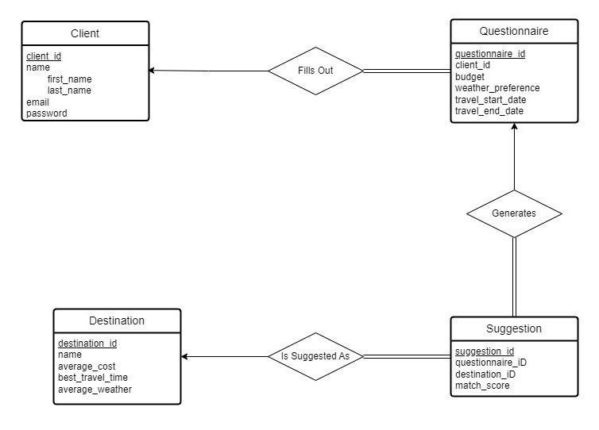

# Travel Guide Application

The Travel Guide Application is a database-driven system created for CS 425: Database Organization at IIT, Fall 2023. It allows users to find travel destinations based on their preferences. Users fill out a questionnaire about their travel interests, budget, and preferred weather. The app then suggests destinations that match these criteria, using a database to store and process user inputs and destination information.

## Project Members

- **Mohamad Dib Fares (A20482852)**
- **Hamza Taheir Bu Obaid (A20500711)**
- **Mehal Gosalia (A20484633)**
- **Rajdeep Singh Konthoujam (A20493036)**

## Entity Relationship Description and Application Basic Structure

### Entity Relationship Description
- **Client**: Represents each user who registers on the application.
  - Attributes:
    - `client_id`: Primary Key
    - `first_name`
    - `last_name`
    - `email`
    - `password`

- **Destination**: Represents each travel destination.
  - Attributes:
    - `destination_id`: Primary Key
    - `name`
    - `average_cost`: Average cost per day
    - `best_travel_time`: Best months for travel
    - `average_weather`: Typical weather condition

- **Questionnaire**: Represents each set of answers provided by the user.
  - Attributes:
    - `questionnaire_id`: Primary Key
    - `client_id`: Foreign Key referencing Client
    - `budget`
    - `weather_preference`
    - `travel_start_date`
    - `travel_end_date`

- **Suggestion**: Represents travel destination suggestions for each user.
  - Attributes:
    - `suggestion_id`: Primary Key
    - `questionnaire_id`: Foreign Key referencing Questionnaire
    - `destination_id`: Foreign Key referencing Destination
    - `match_score`: Score indicating the suitability of the suggestion

### Application Basic Structure
- The application follows a straightforward structure, connecting users with personalized travel suggestions based on their preferences.

## Entity Relationship Diagram

Below is the Entity Relationship Diagram for the Travel Guide Application:



## Source Code: Relational Schema
```sql
CREATE TABLE client (
    client_id SERIAL PRIMARY KEY,
    first_name VARCHAR(255) NOT NULL,
    last_name VARCHAR(255) NOT NULL,
    email VARCHAR(255) NOT NULL UNIQUE,
    password VARCHAR(255) NOT NULL
);

CREATE TYPE temperature_preference AS ENUM ('Freezing', 'Cold', 'Cool', 'Mild', 'Warm', 'Hot', 'Very Hot');

CREATE TABLE questionnaire (
    questionnaire_id SERIAL PRIMARY KEY,
    client_id INT NOT NULL,
    budget DECIMAL(10, 2),
    weather_preference temperature_preference,
    travel_start_date DATE,
    travel_end_date DATE,
    FOREIGN KEY (client_id) REFERENCES client(client_id),
    CHECK (travel_end_date > travel_start_date)
);

CREATE TABLE destination (
    destination_id SERIAL PRIMARY KEY,
    name VARCHAR(255) NOT NULL,
    average_cost DECIMAL(10, 2),
    best_travel_time VARCHAR(255),
    average_weather temperature_preference
);

CREATE TABLE suggestion (
    suggestion_id SERIAL PRIMARY KEY,
    questionnaire_id INT NOT NULL,
    destination_id INT NOT NULL,
    match_score DECIMAL(5, 2),
    FOREIGN KEY (questionnaire_id) REFERENCES questionnaire(questionnaire_id),
    FOREIGN KEY (destination_id) REFERENCES destination(destination_id)
);
```

## Database Setup Instructions

To set up the database for the Travel Guide Application on a PostgreSQL server, follow these steps:

1. **Open Command Line Interface (CLI):**
   - On Windows, open Command Prompt.
   - On MacOS or Linux, open Terminal.

2. **Navigate to the SQL Scripts Directory:**
   - Change directory to where the SQL scripts are located:
     ```
     cd path/to/sql_scripts
     ```

3. **Execute SQL Scripts:**
   - Run the 'create_travel_guide_db.sql' script to create and set up the database:
     ```
     psql -U postgres -f create_travel_guide_db.sql
     ```
   - Then, define the relational schema with 'relational_schema.sql':
     ```
     psql -U postgres -d travel_guide -f relational_schema.sql
     ```
   - Finally, populate the database with sample data using 'sample_data.sql':
     ```
     psql -U postgres -d travel_guide -f sample_data.sql
     ```

Ensure that you replace `path/to/sql_scripts` with the actual path to your SQL scripts. PostgreSQL must be installed and running on your system to execute these steps. For this commands to be executed using the CLI as shown, ensure that `psql` is added to `PATH`.

## Running the Console Application

To run the `travel_guide_app.py` console application, follow these instructions:

1. **Ensure Python is Installed:**
   - Verify that Python is installed on your system by running `python --version` or `python3 --version` in your command line interface (CLI).

2. **Install Required Python Packages:**
     ```bash
     pip install -r requirements.txt
     ```
   - This command installs the `psycopg2` package.

3. **Navigate to the Source Code Directory:**
   - Use the `cd` command to change directory to where `travel_guide_app.py` is located. If the current directory is the root directory of the repository, use:
     ```bash
     cd src
     ```
     Otherwise, replace `src` with the actual path to the application's source code directory.

4. **Update Configuration Parameters:**
   - Open the `config.py` file in your code editor.
   - Modify the `db_params` dictionary to match your local database settings. For example:
     ```python
     db_params = {
         'dbname': 'travel_guide',
         'user': 'your_database_user',
         'password': 'your_database_password',
         'host': 'your_database_host'
     }
     ```
     Replace `'your_database_user'`, `'your_database_password'`, and `'your_database_host'` with the appropriate values for your local database setup. If your local database setup has default parameters, the only field you should modify is `password`.

5. **Run the Application:**
   - Execute the Python script by running:
     ```bash
     python travel_guide_app.py
     ```
     Use `python3` if your system defaults to Python 2 when using `python`.

5. **Follow On-screen Instructions:**
   - Once the application starts, follow any on-screen prompts or instructions provided by the application for its use.
